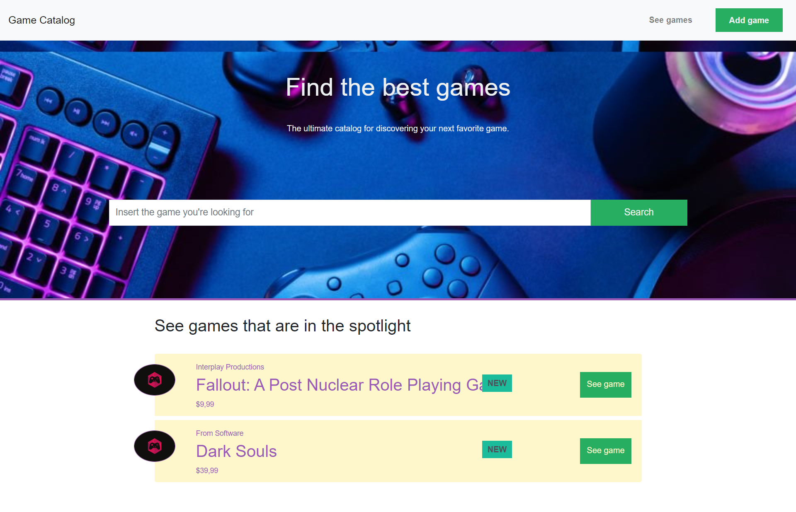
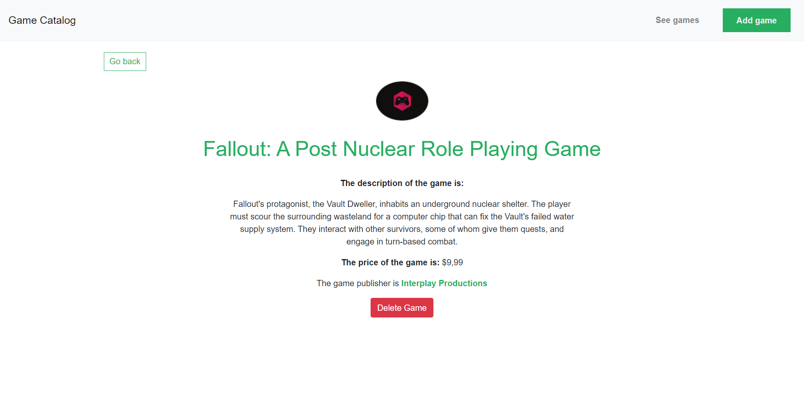

# Game Catalog Website

## Description

The Game Catalog Website is a simple web application that allows users to manage a collection of games. Users can add new games to the catalog, delete games, and view detailed information about each game. The application is built with Node.js and uses a local SQLite database to store and retrieve game information.


## Features

- **Add Games**: Users can add new games to the catalog by providing details like title, genre, release date, and description.

- **Delete Games**: Users can remove games from the catalog.
- **View Game Details**: Users can view detailed information about each game in the catalog.


## Technologies Used

- **Node.js**: The backend server is built using Node.js, providing a lightweight and efficient environment for handling requests.
- **Express.js**: Used for routing and handling HTTP requests.
- **SQLite**: A lightweight, serverless database is used to store and manage game data.
- **HTML/CSS/JavaScript**: The front-end interface is created using standard web technologies for an intuitive user experience.

## Getting Started

### Prerequisites

Ensure you have the following installed on your machine:

- Node.js (v14 or higher)
- npm (Node Package Manager)
- SQLite (included with most Node.js setups) 
- Body-parser
- Express 
- Express-handlebars
- Game-Catalog-Project
- Nodemon
- Sequelize
- Sqlite3

### Installation

1. **Clone the repository:**

   ```bash
   git clone https://github.com/MarjoDev/Game-Catalog-Project.git
   cd Game-Catalog-Project
2. **Install dependencies:**

    ```bash
    npm install
3. **Set up the SQLite database:**

- The project includes a SQLite database file. If it's not present, it will be created automatically when you run the application.
- The database file (app.db) will be stored locally in the project directory.

5. **Run the application:**

    ```bash
    npm start

The server will start, and you can access the application by navigating to http://localhost:3000 in your browser.

### Usage
- Add a Game: Navigate to the "Add Game" section, fill in the game details, and click "Send" to add the game to the catalog.
- Delete a Game: Find the game you want to delete in the catalog and click the view button, then click "Delete" button.
- View Game Details: Click on a game title to view its detailed information.

### Storage Organization
<pre>
Game-Catalog-Project/
├── db/
│   ├── app.db
│   └── connection.js
├── models/
│   └── Game.js
│ 
├── public/
│   ├── css/
│   └── img/
├── routes/
│   └── games.js
├── views/
│   └── layouts/
│       ├── add.handlebars
│       ├── index.handlebars
│       └── view.handlebars
├── .gitignore
├── add.html
├── index.html
├── index.js
├── package-lock.json
├── package.json
└── README.md
</pre>
### Contact
If you have any questions or suggestions, feel free to open an issue or contact the project maintainer at marjopereira10@gmail.com